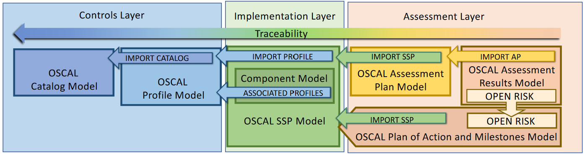

# NIST explorer

The intent is to aggregate openly available information provided by NIST and other security
focused entities to facilitate exploration of 

## Sparta

[SPARTA](https://sparta.aerospace.org/) is intended to provide unclassified information to space professionals about how spacecraft may be compromised via cyber and traditional counterspace means.

It provides a nice catalog of info which is openly accessibly with caveat the Apache 2 license stays with the information.

## OSCAL

> The [Open Security Controls Assessment Language (OSCAL)](https://pages.nist.gov/OSCAL/) created and maintained by NIST is the state of the art for compliance automation. OSCAL provides a mechanism for turning cybersecurity artifacts from static PDFs, Excel spreadsheets, and Word documents into machine-readable code. Reformating the data in this way is a critical first step to unlock the power of automation. 
> 
|                                                   |
|:------------------------------------------------------------------------------------:|
|                            <b> Image Credits - NIST </b>                             |
| <b> Text Credits - [FATHOM5CORP/oscal](https://github.com/FATHOM5CORP/oscal/blob/main/README.md) </b> |

General Links
- [Index of a bunch of open source OSCAL tools](https://github.com/oscal-club/awesome-oscal)
OSCAL language files
- [OSCAL version of NIST 800-53r5 controls](https://github.com/usnistgov/oscal-content/tree/main/nist.gov/SP800-53/rev5/json)
- [Community driven OSCAL version of NIST 800-171r2 controls](https://github.com/FATHOM5CORP/oscal/blob/main/README.md)
- [Example component definitions for stuff like AWS, SSH, djago](https://github.com/CivicActions/oscal-component-definitions/tree/main)
- [Lorem Ipsum level examples of components, catalogs, ssp, etc](https://github.com/EasyDynamics/oscal-demo-content)
- [FedRAMP automation](https://github.com/GSA/fedramp-automation)
  - [FedRAMP rev5 baselines](https://github.com/GSA/fedramp-automation/tree/master/dist/content/rev5/baselines/json)
  - [FedRAMP rev5 SSP,POAM,etc templates](https://github.com/GSA/fedramp-automation/tree/master/dist/content/rev5/templates)
React Resources
- EasyDynamics
  - [OSCAL React Library/viewer](https://github.com/EasyDynamics/oscal-react-library)
    - [Viewer live demo](https://viewer.oscal.io/) 
  - [OSCAL REST Service](https://github.com/EasyDynamics/oscal-rest-service/tree/develop)
  - [OSCAL editor deploy](https://github.com/EasyDynamics/oscal-editor-deployment) - combo of react lib, viwer, api
    - ["All-in-one" editor Dockerfile](https://github.com/EasyDynamics/oscal-editor-deployment/blob/main/all-in-one/Dockerfile)
  - [2022 NIST presentation](https://csrc.nist.gov/csrc/media/Events/2022/3rd-oscal-workshop/documents/1.t3%20-%20Lunch%20-%20EasyDynamics_DevSecComp(liance)Ops%20with%20OSCAL%20(Submitted).pdf) 